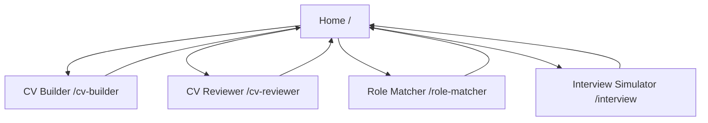
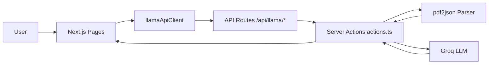
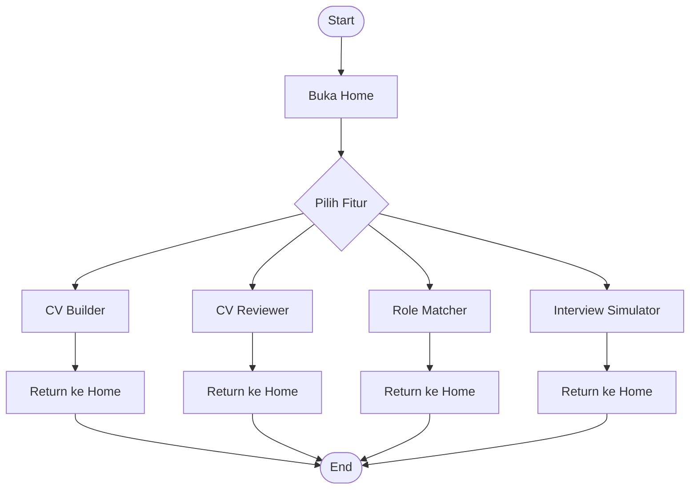
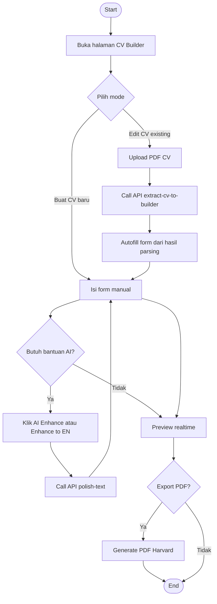
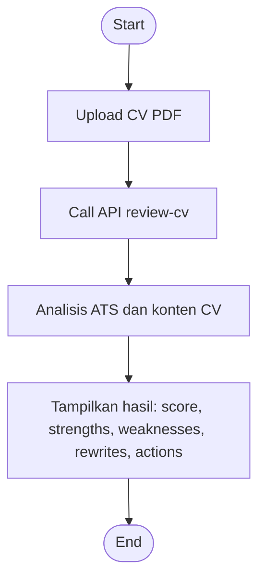
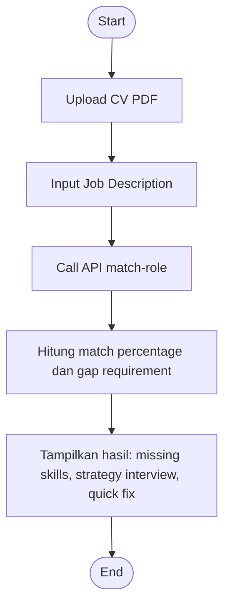
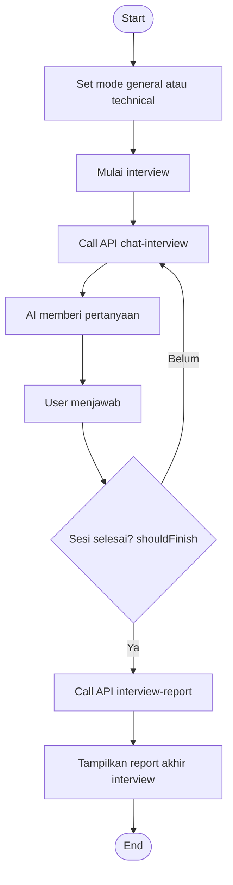

# Dokumentasi Navigasi, Use Case, dan Activity Diagram

Dokumen ini merangkum alur aplikasi Career AI Platform berdasarkan implementasi saat ini.

Catatan scope:
- Alur autentikasi dan halaman login sengaja tidak dimasukkan.
- Fokus hanya pada alur fitur yang aktif dipakai pengguna.

## 1. Struktur Navigasi Program

### 1.1 Navigasi Halaman Utama (tanpa login)

### 1.2 Pemetaan Halaman dan API yang Dipakai

- Home `/`
  - Tujuan: landing page dan entry point semua fitur.
  - Link fitur: CV Builder, CV Reviewer, Role Matcher, Interview Simulator.

- CV Builder `/cv-builder`
  - API yang dipakai:
    - `POST /api/llama/extract-cv-to-builder` untuk import CV PDF lama ke form builder.
    - `POST /api/llama/polish-text` untuk AI enhance/translate summary dan bullet.
  - Fitur lokal:
    - Realtime preview.
    - Export PDF Harvard via komponen PDF.

- CV Reviewer `/cv-reviewer`
  - API yang dipakai:
    - `POST /api/llama/review-cv` untuk analisis ATS + rekomendasi rewrite.

- Role Matcher `/role-matcher`
  - API yang dipakai:
    - `POST /api/llama/match-role` untuk mencocokkan CV vs Job Description.

- Interview Simulator `/interview`
  - API yang dipakai:
    - `POST /api/llama/chat-interview` untuk sesi tanya jawab interview.
    - `POST /api/llama/interview-report` untuk evaluasi akhir interview.

### 1.3 Struktur Layer Interaksi

## 2. Use Case

Aktor utama:
- Kandidat/Pencari kerja.

### 2.1 Daftar Use Case

| ID | Use Case | Tujuan | Input Utama | Output |
|---|---|---|---|---|
| UC-01 | Buat CV baru | Menyusun CV Harvard dari nol | Data personal, pendidikan, pengalaman, proyek, skill, award | Draft CV + preview realtime + PDF |
| UC-02 | Import CV existing | Mempercepat editing CV lama | File PDF CV | Form builder terisi otomatis |
| UC-03 | Polish konten CV | Memperbaiki kualitas bahasa bullet/summary | Teks summary/bullet + mode enhance/translate | Teks hasil polishing AI |
| UC-04 | Review CV | Menilai kesiapan ATS dan kualitas CV | File PDF CV | Skor ATS, strengths/weaknesses, red flags, action plan |
| UC-05 | Match CV vs Job Desc | Menilai kecocokan kandidat dengan lowongan | File PDF CV + Job Description | Match score, gap skill, interview strategy, tailoring bullets |
| UC-06 | Simulasi interview | Latihan interview general/technical | Mode interview, riwayat jawaban, job context (opsional) | Pertanyaan lanjutan AI sampai sesi selesai |
| UC-07 | Generate interview report | Mendapat evaluasi akhir performa interview | Transkrip interview | Score, verdict, strengths, area improvement, better answers |

### 2.2 Ringkasan Alur Per Use Case

- UC-01 Buat CV baru
  - User buka CV Builder.
  - User isi form section.
  - User dapat melihat preview secara langsung.
  - User export PDF.

- UC-02 Import CV existing
  - User pilih mode edit CV existing.
  - User upload PDF.
  - Sistem parse PDF dan strukturkan data CV.
  - Form terisi otomatis dan user bisa lanjut edit.

- UC-03 Polish konten CV
  - User klik AI Enhance atau Enhance to EN.
  - Sistem kirim teks ke endpoint polish.
  - Hasil AI menggantikan teks lama pada field terkait.

- UC-04 Review CV
  - User upload CV pada halaman reviewer.
  - Sistem melakukan analisis ATS dan kualitas konten.
  - User melihat dashboard hasil analisis.

- UC-05 Match CV vs Job Desc
  - User upload CV dan tempel JD.
  - Sistem menilai kecocokan requirement.
  - User menerima gap skill dan rekomendasi perbaikan cepat.

- UC-06 dan UC-07 Interview
  - User pilih mode interview dan mulai sesi.
  - AI mengajukan pertanyaan bertahap berdasarkan jawaban user.
  - Saat sesi selesai, sistem membuat report evaluasi akhir.

## 3. Activity Diagram

### 3.1 Activity Diagram Utama Aplikasi

### 3.2 Activity Diagram CV Builder

### 3.3 Activity Diagram CV Reviewer

### 3.4 Activity Diagram Role Matcher

### 3.5 Activity Diagram Interview Simulator

## 4. Ringkasan Endpoint Internal (tanpa login)

- `POST /api/llama/extract-cv-to-builder`
- `POST /api/llama/polish-text`
- `POST /api/llama/review-cv`
- `POST /api/llama/match-role`
- `POST /api/llama/chat-interview`
- `POST /api/llama/interview-report`

Semua endpoint di atas ditangani melalui route handler dan diteruskan ke server actions pada `src/app/actions.ts`.
